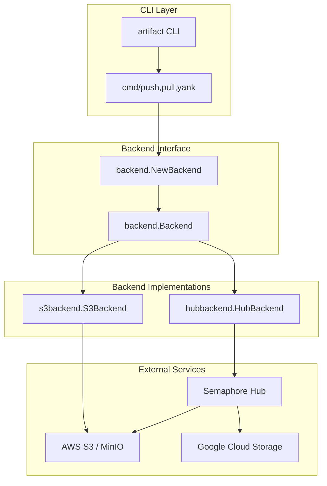
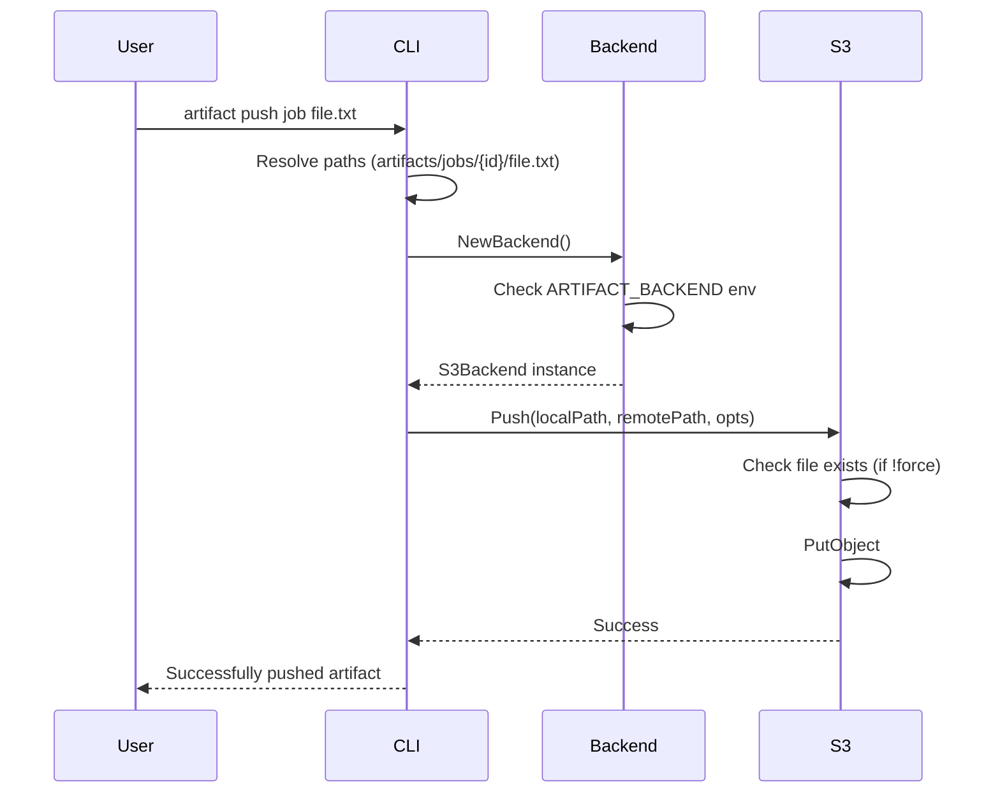
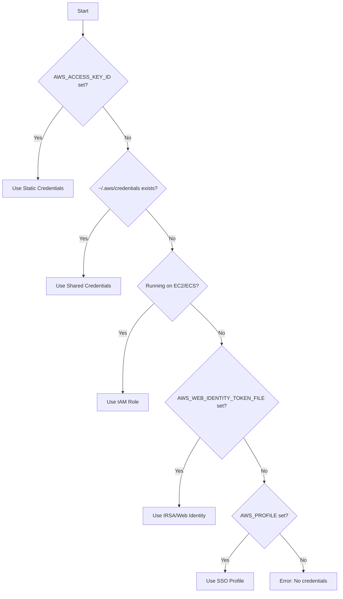

# S3 Backend Technical Documentation

This document describes the architecture and implementation of the S3 direct storage backend for the artifact CLI.

## Architecture Overview

The artifact CLI uses a pluggable backend system that allows different storage providers. The S3 backend enables direct communication with S3-compatible storage without requiring the Semaphore Hub service.



## Component Design

### Backend Interface

The `Backend` interface defines the contract for all storage backends:

```go
type Backend interface {
    Push(ctx context.Context, localPath, remotePath string, opts PushOptions) error
    Pull(ctx context.Context, remotePath, localPath string, opts PullOptions) error
    Yank(ctx context.Context, remotePath string) error
    Exists(ctx context.Context, remotePath string) (bool, error)
    Close() error
}
```

### Request Flow



## Configuration

### Environment Variables

| Variable | Required | Default | Description |
|----------|----------|---------|-------------|
| `ARTIFACT_BACKEND` | Yes | `hub` | Backend type: `hub` or `s3` |
| `ARTIFACT_S3_BUCKET` | Yes (for s3) | - | S3 bucket name |
| `ARTIFACT_S3_REGION` | No | auto-detect | AWS region |
| `ARTIFACT_S3_ENDPOINT` | No | - | Custom S3 endpoint URL |
| `ARTIFACT_S3_FORCE_PATH_STYLE` | No | `false` | Use path-style URLs |
| `ARTIFACT_S3_PREFIX` | No | - | Path prefix for all objects |

### Authentication Chain

The S3 backend uses AWS SDK v2's default credential provider chain:



## Path Resolution

Artifact paths follow the same structure regardless of backend:

```
artifacts/{level}/{id}/{path}

Examples:
- artifacts/projects/my-project/release.tar.gz
- artifacts/workflows/abc-123/build-output/
- artifacts/jobs/job-456/test-results.xml
```

The path resolver uses environment variables to determine IDs:
- `SEMAPHORE_PROJECT_ID` for project-level artifacts
- `SEMAPHORE_WORKFLOW_ID` for workflow-level artifacts
- `SEMAPHORE_JOB_ID` for job-level artifacts

## Error Handling

The backend defines standard error types:

| Error | Description |
|-------|-------------|
| `ErrNotFound` | Artifact does not exist |
| `ErrAlreadyExists` | Artifact exists (push without force) |
| `ErrPermissionDenied` | Insufficient permissions |

## Testing

The S3 backend includes unit tests using [gofakes3](https://github.com/johannesboyne/gofakes3), an in-memory S3 server:

```go
func TestS3Backend_Push(t *testing.T) {
    // Creates in-memory S3 server
    faker := gofakes3.New(s3mem.New())
    server := httptest.NewServer(faker.Server())
    defer server.Close()
    
    // Test push operations against fake S3
    // ...
}
```

Run tests:
```bash
go test -v ./pkg/backend/s3backend/...
```

## Migration from Hub Backend

To migrate from Hub to S3 backend:

1. **Set up S3 bucket** with appropriate permissions
2. **Configure credentials** via environment or AWS config
3. **Set environment variables**:
   ```bash
   export ARTIFACT_BACKEND=s3
   export ARTIFACT_S3_BUCKET=my-bucket
   ```
4. **Test with a non-critical workflow** before full migration

The CLI commands remain identical—only the backend configuration changes.

## Performance Considerations

- **Large files**: Consider enabling S3 Transfer Acceleration for cross-region uploads
- **Many small files**: The backend uploads files sequentially; parallel uploads not yet implemented
- **Directory operations**: Uses S3 ListObjectsV2 for efficient prefix-based listing
